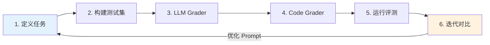
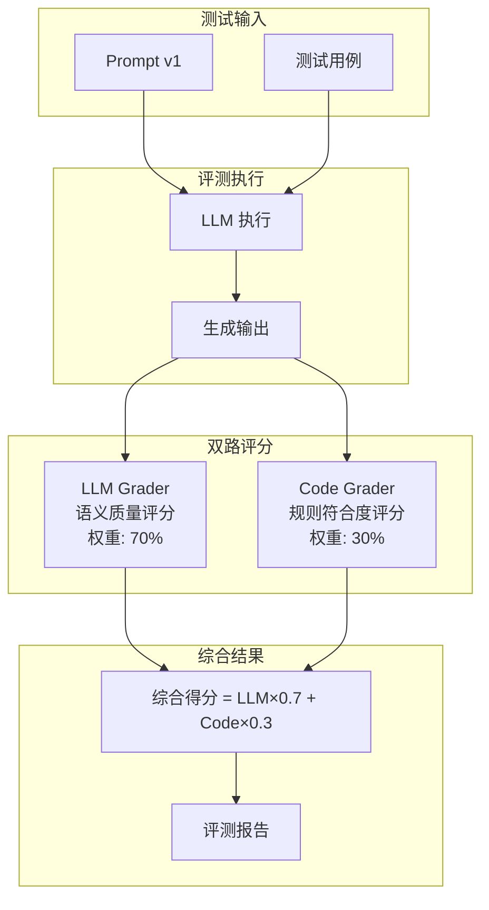

# Prompt Eval

> 一个轻量级的 Prompt 评测与迭代工具，帮助开发者系统化地评估和优化 AI Prompt。


## 快速开始

直接在浏览器中打开 `prompt-eval-studio.html` 即可使用，无需安装任何依赖。

```bash
open prompt-eval-studio.html
```

## 核心流程

Prompt Eval 遵循**六步迭代流程**，帮助开发者从定义任务到持续优化：



### 六步流程详解

1. **定义任务** — 明确 AI 需要完成的任务类型和预期输出格式
2. **构建测试集** — 创建多样化的测试用例，覆盖典型场景和边界情况
3. **配置 LLM Grader** — 设置语义评分标准，定义"好回答"的标准
4. **配置 Code Grader** — 添加规则校验，如格式检查、关键词匹配等
5. **运行评测** — 系统自动运行测试，生成详细的评测报告
6. **迭代对比** — 根据失败用例优化 Prompt，v1/v2 对比验证改进效果

## 双路评分架构



## 功能特性

### 🎯 双路评分系统

| 评分器 | 评估维度 | 权重 | 适用场景 |
|--------|----------|------|----------|
| **LLM Grader** | 语义理解、回答质量、逻辑连贯性 | 70% | 开放式问答、创意生成、对话质量 |
| **Code Grader** | 格式规范、规则符合、关键词匹配 | 30% | 代码生成、结构化输出、格式校验 |

- **LLM Grader**: 基于语义理解的质量评分（权重可配置，默认 70%）
- **Code Grader**: 基于规则的自动化校验（权重可配置，默认 30%）

### 📊 智能评测报告

| 报告类型 | 内容说明 |
|----------|----------|
| 总体评分 | 综合得分、通过率、平均分统计 |
| 单用例分析 | 得分详情、耗时、Token 消耗 |
| 失败归因 | 失败用例分类、失败原因分析 |
| 版本对比 | v1/v2 并排对比、改进幅度可视化 |

### 🤖 AI 辅助功能

- **自动生成测试用例**: 基于任务描述智能生成测试集
- **自动生成 Rubric**: 自动创建评分标准和评分维度
- **智能权重建议**: 根据任务类型推荐 LLM/Code 权重配比

### 📈 迭代优化

- 一键生成 v2 Prompt 建议
- 并排对比 v1/v2 评测结果
- 失败用例聚类分析


## 技术说明

- **纯前端实现**: HTML + CSS + JavaScript，无需后端服务
- **API 兼容**: 支持 OpenAI 兼容的 API 格式（如 OpenRouter）
- **数据本地存储**: 评测数据保存在浏览器本地，保护隐私


## 最佳实践

1. **测试集设计**: 覆盖典型场景 + 边界情况 + 对抗样本
2. **评分标准**: LLM Grader 关注语义质量，Code Grader 关注格式正确
3. **迭代策略**: 先分析失败模式，再针对性优化 Prompt
4. **版本对比**: 使用 v1/v2 对比验证改进效果，避免回归


## License

MIT License

---

